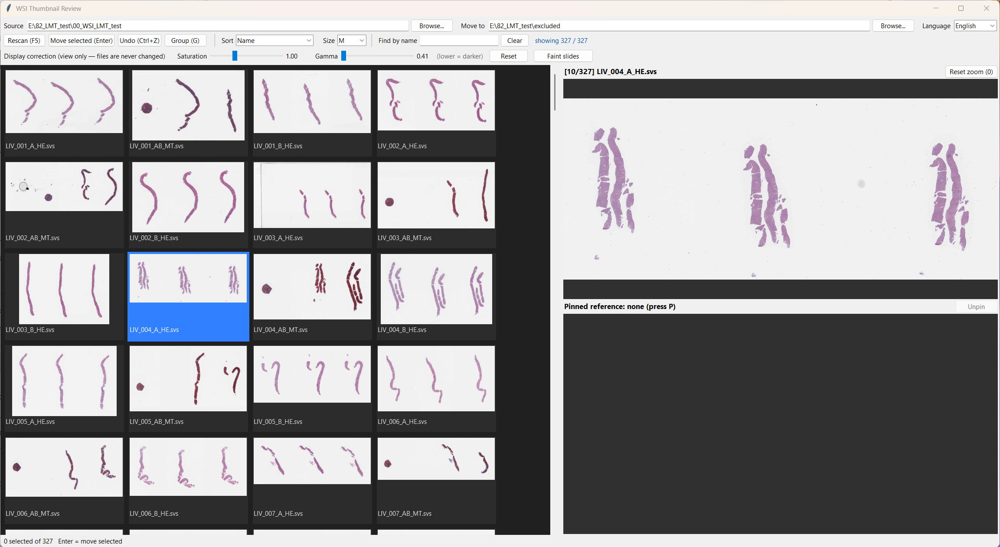

# WSI Thumbnail Review

**Fast thumbnail review and sorting of Aperio `.svs` whole-slide images.**

A small desktop tool for cleaning up a folder of whole-slide images before analysis: flip through hundreds of
slides, spot duplicates, faint or misaligned serial sections, move them aside, and tag which H&E lines up with which
IHC section. It reads only the small thumbnail page embedded in each `.svs` (no full-resolution decode), so even
multi-GB slides appear in about a second, and the thumbnails are cached for instant re-opening.



## Features

- **Thumbnail grid** of every `.svs` / `.tif` / `.tiff` in a folder, cached in `<folder>/.wsi_thumbs`.
- **Sort and filter** — name, modified date, size; find by part of the file name.
- **Preview and compare** — wheel zoom / drag pan, and a *pinned reference* slide that zooms along with the preview,
  for checking orientation and alignment of serial sections.
- **Display correction** — saturation and gamma sliders for faint slides (view only; files are never changed).
- **Move with undo** — selected slides are moved to a target folder, logged to `move_log.csv`, undoable with Ctrl+Z.
- **Grouping** — tag matching H&E / IHC sections in the block field (`S 2024000123,A,.svs` → `S 2024000123,A_1,.svs`)
  so they sort together; logged to `rename_log.csv` and undoable.
- **Korean / English** user interface (switch any time from the toolbar).

## Download (Windows, no Python needed)

Download `WSI_Review.exe` from the [Releases](https://github.com/kbsmc-path/wsi-thumbnail-review/releases) page and
double-click it (or drop a folder onto it). A console window opens alongside — it is the log window; close the review
window to exit.

## Run from source

Requires **Python 3.8+** with tkinter (included in the python.org installer) and **Pillow**.

```bat
git clone https://github.com/kbsmc-path/wsi-thumbnail-review.git
cd wsi-thumbnail-review
python -m pip install -r requirements.txt
python wsi_review.py
```

On Windows you can also double-click `run.bat` (uses `.venv` if present) or drag a folder onto it.
Without git: **Code › Download ZIP** and keep all files in one folder (`wsi_review.py` needs `i18n.py`).

If something is missing, the program says what and how to install it instead of crashing, for example:

```
[!] The Pillow package is missing: No module named 'PIL'
    Install it from this folder, then run again:
        python -m pip install -r requirements.txt
```

| Missing | Install |
|---|---|
| Pillow | `python -m pip install -r requirements.txt` (or `python -m pip install pillow`) |
| tkinter (Linux) | Ubuntu/Debian `sudo apt install python3-tk` · Fedora `sudo dnf install python3-tkinter` |
| tkinter (macOS Homebrew) | `brew install python-tk` |
| `ImageTk` (Linux distro Pillow) | `sudo apt install python3-pil.imagetk` |
| `i18n.py` | download the whole repository, not just `wsi_review.py` |

## Usage

```
python wsi_review.py [source_folder] [target_folder]
python wsi_review.py --check <folder>      # print which TIFF page is used per file (no GUI)
```

| Input | Action |
|---|---|
| Click / Ctrl+Click / Shift+Click | focus (preview) / toggle selection / select range |
| Arrows, Home/End, PageUp/PageDown | move focus |
| Space · Ctrl+A · Esc | toggle selection · select all · clear |
| Enter or M | move selected files to the target folder |
| Ctrl+Z | undo last move / rename |
| P · Shift+P | pin focused slide as reference · release pin |
| G | group selected slides (block tag, e.g. `A` → `A_1`) |
| + / − · F5 · Ctrl+F · 0 | thumbnail size · rescan · find by name · reset zoom |
| Wheel / drag / double-click on preview | zoom / pan / reset |

Notes

- Moving between different drives is a copy + delete and is slow; use a target folder on the same drive.
- Filtered-out slides that are still selected are moved too — the status bar says how many.
- Everything (scan, errors, moves, undo) is also written to `wsi_review.log` next to the program.

## 한국어 요약

SVS 파일에 들어 있는 작은 썸네일만 읽어 수백 장의 슬라이드를 빠르게 훑어보고, 중복되거나 정렬이 맞지 않는
연속절편을 다른 폴더로 옮기거나(Ctrl+Z로 취소), H&E–면역염색 짝을 그룹으로 묶는 도구입니다.

- **exe로 실행**: [Releases](https://github.com/kbsmc-path/wsi-thumbnail-review/releases)에서 `WSI_Review.exe`를 받아 더블클릭
  (Python 설치 불필요). 함께 뜨는 검은 창은 기록 창입니다.
- **소스로 실행**: Python 3.8 이상 설치 후 이 폴더에서
  `python -m pip install -r requirements.txt` → `python wsi_review.py` (또는 `run.bat` 더블클릭).
  필요한 모듈이 없으면 무엇을 어떻게 설치해야 하는지 안내 창이 뜹니다.
- 사용 순서: 원본 폴더 지정 → [다시 스캔] → Ctrl+클릭으로 선택 → Enter로 이동 (Ctrl+Z 취소) → 필요하면 G로 그룹 지정.
  단축키는 위 Usage 표를 참고하세요.

## Build the .exe

```bat
python -m pip install pyinstaller pillow
python build_exe.py            :: -> exe\WSI_Review.exe
```

Built as PyInstaller *onefile + console*: Windows Smart App Control blocks the unsigned windowed bootloader, and the
console doubles as the log window.

## License

[MIT](LICENSE)
